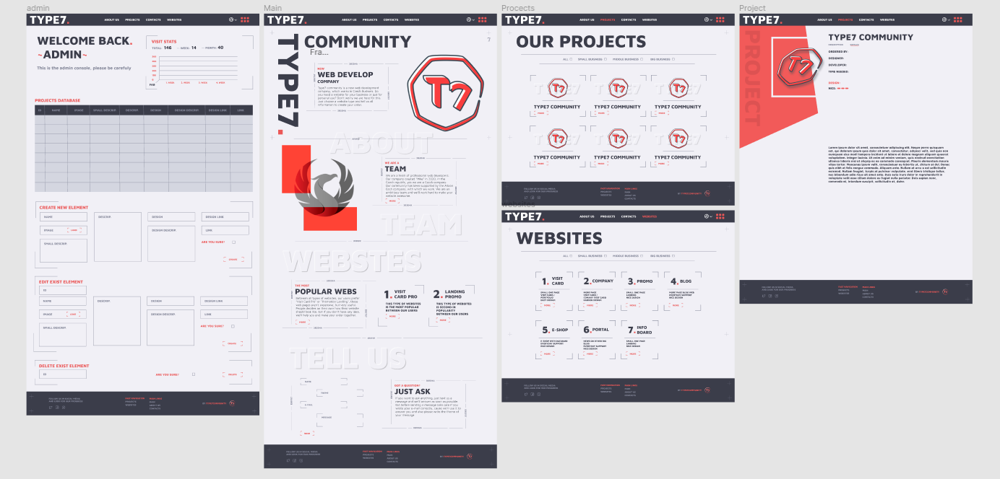

<p align="center">
  <a href="#">
    
  </a>
  <p align="center">
   
  </p>
  <h1 align="center"><b>TYPE7</b></h1>
  <p align="center">
  A test website
    <br />
    <br />
    <b>Download for </b>
    macOS
    ·
    Windows
    ·
    Linux
    ·
    iOS
    ·
    watchOS
    ·
    Android
    <br />
    <i>~ download whenever you want ~</i>
  </p>
</p>

---

## Run locally

>   #### Download zip -> https://github.com/MikeB35/type7

>   #### Download MySQL Workbench -> https://dev.mysql.com/downloads/workbench/
>   1. Create a Schema(database)
>   2. Import SQL files (server -> Import Data -> Import from Self-Contained File) or create a **New Table**
>   3. Create a new user:
    ```sql
        CREATE USER 'sqluser'@'%' IDENTIFIED WITH mysql_native_password BY 'password' ;
        GRANT ALL PRIVILEGES ON *.* TO 'sqluser'@'%' ;
        FLUSH PRIVILEGES;
    ```
>   Now your login: sqluser password: password
>   4. In Visual Code download <p style="color: #f20d3e">**Database Client**</p> extension
>   5. Create a new connection: server: *127.0.0.1* login: *sqluser* password: *password*
>   6. Click *+Connect* to check the connection, than *Save*

>   #### Download PHP 8.2 (VS16 x64 Thread Safe) or later version -> https://windows.php.net/download#php-8.2
>   1. Extract files from zip and move them to **C:/** Disk 
>   2. Rename folder to **php**
>   3. In folder create *php.ini* file and write **extension=mysqli** in it
>   4. Go to *Control Panel* -> System and Security -> System -> Additional system settings -> Environment parameters -> System variables -> Path -> Edit -> Create -> **C:\php**
>   5. In Visual Studio download **PHP Intelephense** and **PHP Server** extensions
>   6. In extensions write *@builtin php* and disable **PHP Language Features**

# Screenshots

## Authors

- [@MikeB35](https://www.github.com/MikeB35)
